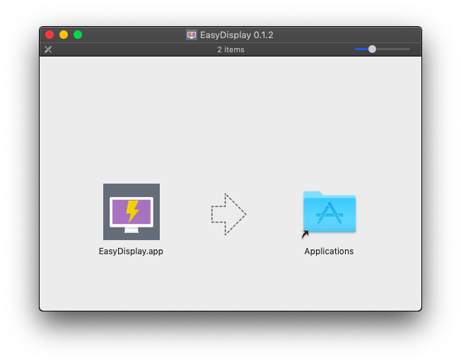
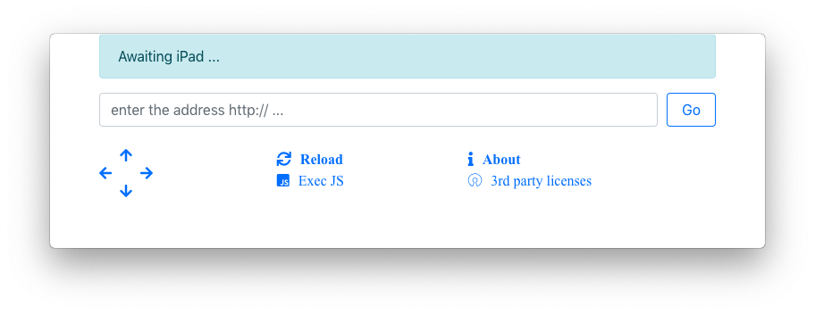
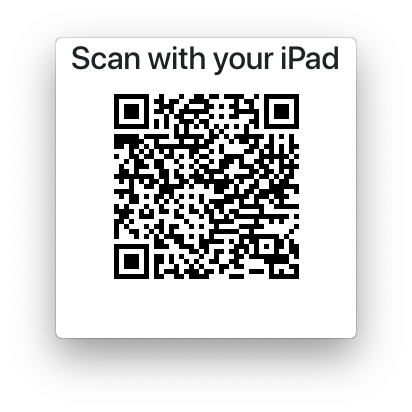
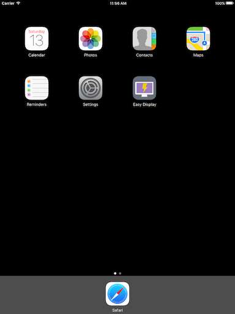
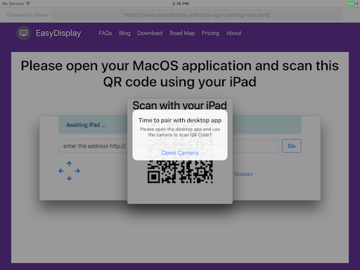
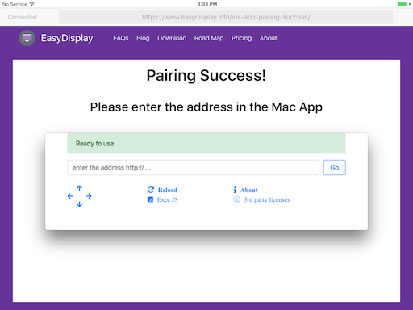
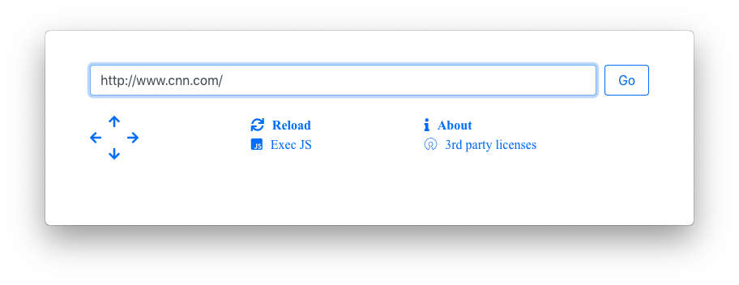

Let us take EasyDisplay for a quick spin,

Download the latest [MacOS Client](/download), and install it.

Run the desktop app, you should get it running.

You should also get a QR Code.

Open the iOS application,

And scan the QR Code using the App's camera

If you see this on your iPad, then you are all set

Now, start using EasyDisplay from your Mac app:

---
