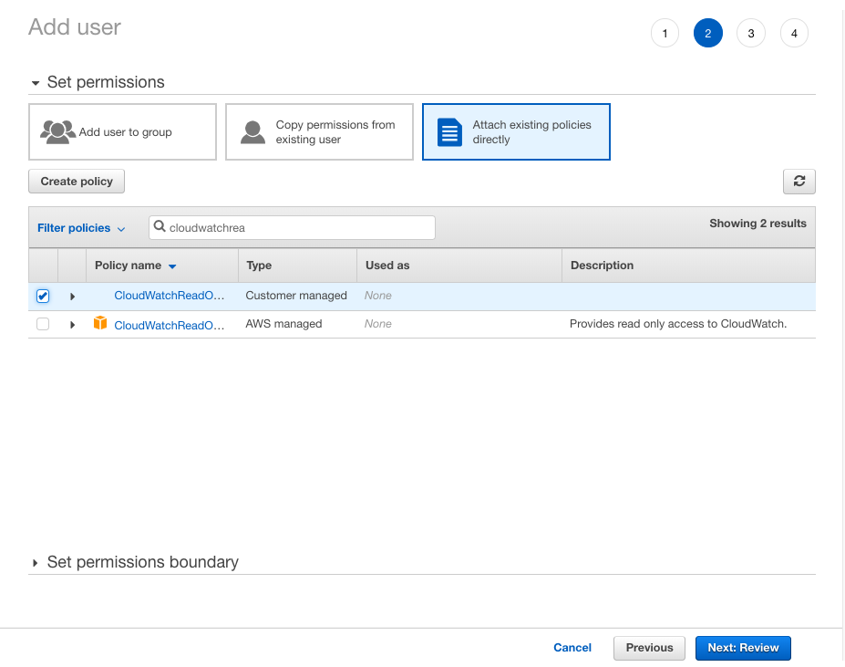

# Using EasyDisplay to monitor your AWS CloudWatch resources


Let us say you have a AWS Account and some resouces running there, 
and let us say you wish to keep an eye on those resources using EasyDisplay on your iPad.

We shall do that using the following steps:

  * create the necessary AWS IAM policies
  * creating a new user for easydisplay on AWS
  * get the federated link for login
  * create a guage on AWS CloudWatch
  * arrange the dashboard
  
---


###### let us start and login to [AWS console account](https://console.aws.amazon.com/console/home):
 

---

###### go to IAM:


---

###### Create the necessary policy for read only access to CloudWatch:
 


Policy Name: *CloudWatchReadOnlyAccess*

Policy JSON:

```JSON
{
   "Version": "2012-10-17",
   "Statement": [
       {
           "Action": [
               "autoscaling:Describe*",
               "cloudwatch:Describe*",
               "cloudwatch:Get*",
               "cloudwatch:List*",
               "logs:Get*",
               "logs:List*",
               "logs:Describe*",
               "logs:TestMetricFilter",
               "logs:FilterLogEvents",
               "sns:Get*",
               "sns:List*"
           ],
           "Effect": "Allow",
           "Resource": "*"
       }
   ]
}
 ```
---

###### Time to create the IAM user


###### Create a new user called: easydisplay, and set the password to: passowrd


 
---

###### Attach the policy: CloudWatchReadOnlyAccess to the new user



###### Get the IAM users sign-in link:


for example: this was my sign-in link is:

```
https://344790573488.signin.aws.amazon.com/console
```

---

###### we need to create the CloudWatch Dashboard


---

###### Create the dashboard, and name it EasyDisplay:


---

###### Let us create the CloudWatch Widget in the new dashboard

* Create Widget
* Widget type: Number
* Metric: S3 metric, Storage Metrics of a bucket
* AllStorage Types, Number Of Object
* Statistic Sum
* Period: 30 Days


###### now edit the widget


###### set the Statistic to: Sum


###### set the Period to: 30 Days


---

###### Now it is time to use *EasyDisplay*
###### if you have't installed and paired yet, please check [this post](/using-easy-display).

---

###### launch easydisplay, and for the url, use the sign-in link we got previously, and add *#dashboards:name=EasyDisplay* to it

for example my final url is:
```
https://344790573488.signin.aws.amazon.com/console/cloudwatch?region=eu-west-1#dashboards:name=EasyDisplay
```


---

###### now run the following javascript: 

```js

/* YOU NEED TO CHANGE THE FOLLOWING - BEGIN*/
var userName = "easydisplay";
var userPassword = "password";
/* YOU NEED TO CHANGE THE FOLLOWING - END*/


var element = document.getElementById('username');

element.value = userName;
var ev = new Event('input', { bubbles: true});
ev.simulated = true;
element.value = userName;
element.defaultValue = userName;
element.dispatchEvent(ev);

var element2 = document.getElementById('password');
var ev2 = new Event('input', { bubbles: true});
ev2.simulated = true;
element2.value = userPassword;
element2.defaultValue = userPassword;
element2.dispatchEvent(ev2);

document.getElementById('signin_button').click();


var hideSidebarButton = document.getElementById("gwt-debug-toggleButton");
var ev3 = new Event('mousedown', { bubbles: true});
hideSidebarButton.dispatchEvent(ev3);


//   refresh
 document.getElementsByClassName("refresh")[0].dispatchEvent(
   new Event("click", {bubbles: true})
 ); 


// open menu
var ev4 = new Event('click', { bubbles: true});
document.getElementsByClassName("cwdb-refresh-controls")[0].getElementsByClassName("cwui-dropdown-toggle")[0].dispatchEvent( ev4 );


document.getElementsByClassName("cwui-dropdown-menu")[0].children[0].children[0].children[0].checked = true
var ev5 = new Event('click', { bubbles: true,cancelable: false});
ev5.simulated = true;
document.getElementsByClassName("cwui-dropdown-menu")[0].children[0].children[0].children[0].dispatchEvent(ev5);

//dismiss menu
var ev6 = new Event('click', { bubbles: true});
document.getElementsByClassName("cwdb-refresh-controls")[0].getElementsByClassName("cwui-dropdown-toggle")[0].dispatchEvent( ev6 );


```


