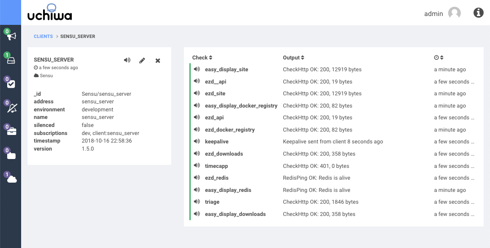
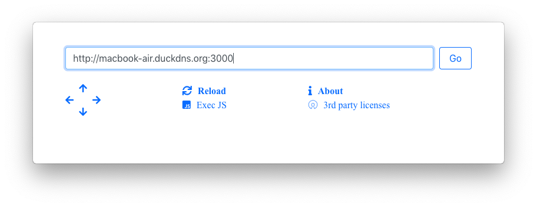

##### Easy Display & Sensu


Sensu is a an open-source project for monitoring services. 
You can use easy-display easily to keep an eye on sensu.



---

for a beginning let us run sensu on your server.

```bash
 
git clone https://github.com/tillawy/sensu-docker-composer.git
cd sensu-docker-composer
docker-composer up
 
```

you can use login to sensu  on
 
* URL: *http://your-server-hostname:3000* 
* Username: *admin*
* Password: *secret* please change it

---

now let us EasyDisplay, please make sure that your Mac & iOS apps are paired, or follow [this post](/using-easy-display).

---

now open the url using EasyDislplay:



---

now let us login using the following JS, dont 

```json
  
  function login(username, password){
    var element = document.forms[0].getElementsByTagName( 'input' )[0];
    element.value = username;
    var ev = new Event('input', { bubbles: true});
    ev.simulated = true;
    element.defaultValue = username;
    element.dispatchEvent(ev);
    
    element = document.forms[0].getElementsByTagName( 'input' )[1];
    element.value = password;
    var ev = new Event('input', { bubbles: true});
    ev.simulated = true;
    element.defaultValue = password;
    element.dispatchEvent(ev);
    
    document.forms[0].getElementsByTagName( 'button' )[0].click()
  }
  
  login("admin", "secret"); 
  
```

---

Enjoy
-

---

---
